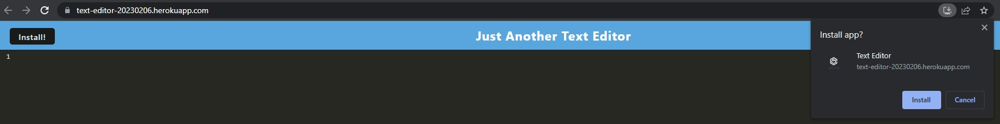
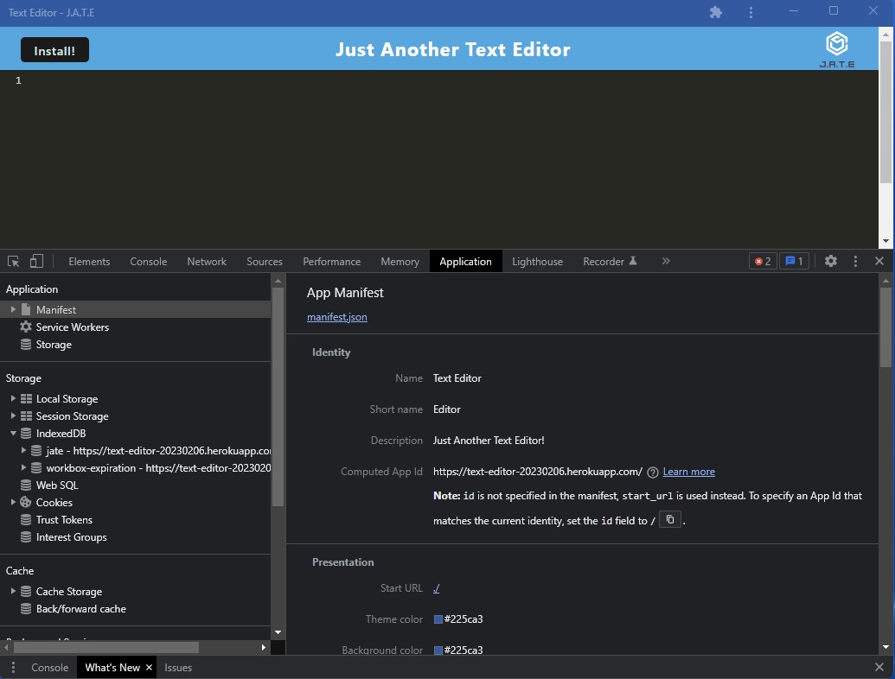
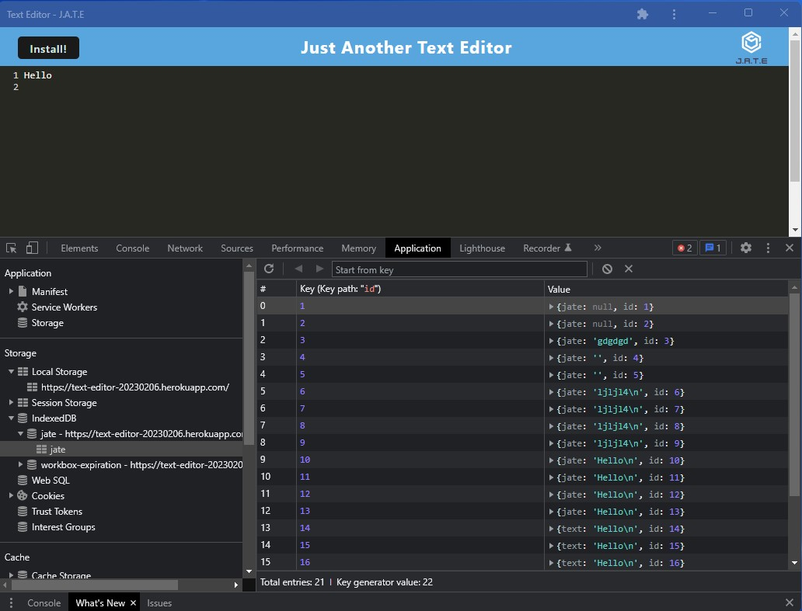

[](https://opensource.org/licenses/MIT)

# Text Editor Starter Code

## Project Description
Create notes or code snippets with or without an internet connection so the user can reliably retrieve them for later use

## Table of Content

* [Preview](#preview)

* [Installation](#installation)

* [Usage](#usage)

* [License](#license)

* [Contributing](#contributing)

* [Question](#question)

## Preview
[*Heroku*](https://text-editor-20230206.herokuapp.com/)

*Install:*



*Manifest:*



*Service Worker:*


*IndexedDB:*




## Installation
To install the necessary dependencies, run the following command:

```
npm install 
```

To use this application on [*Heroku*](https://text-editor-20230206.herokuapp.com/), simply click *Install* after launch the app.

## Usage
After install the necessary dependencies, run below command in terminal to start the application:

```
npm run start:dev
```

## License
This project is licensed under the 

[](https://opensource.org/licenses/MIT)

## Contributing
N/A
  
## Question
* Connect me on [Github](https://github.com/ykuang321)
* For any additional questions/information, contact me by Email: **kuangye869@gmail.com**
